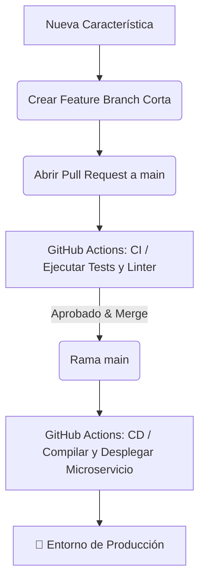

# 🚀 Microservicio de Patentes y Validación

Este repositorio contiene el código fuente de nuestro microservicio, diseñado para iterar de manera rápida, segura y automatizada utilizando herramientas modernas de integración y despliegue.

---

## 🚀 Estrategia de Ramificación y Despliegue

Para este microservicio hemos seleccionado **Trunk-Based Development (TBD)** en combinación con **GitHub Actions** para gestionar nuestro ciclo de vida de desarrollo y automatización de despliegues.

### 🛠️ Justificación de la Elección
* **Despliegue Continuo Eficiente (CD):** Al ser un microservicio, la velocidad de iteración es clave. GitHub Actions reacciona instantáneamente a cada evento en la rama principal, eliminando la necesidad de ramas intermedias (como `develop` o `release`) y acelerando el *time-to-market*.
* **Feedback Temprano (CI):** Cada *Pull Request* activa pruebas automatizadas de manera inmediata. Esto garantiza que el código defectuoso se detecte antes de llegar a la rama principal.
* **Reducción del "Merge Hell":** Las ramas de características cortas evitan conflictos de código masivos y complejos, manteniendo el repositorio limpio y fácil de mantener.

---

### 🔄 Flujo de Trabajo (Workflow)

El ciclo de desarrollo y despliegue sigue un camino lineal y automatizado:



1. **Desarrollo:** El desarrollador crea una rama de vida corta (`feature/nombre-tarea`) desde `main`.
2. **Integración Continua (CI):** Al abrir un *Pull Request* hacia `main`, **GitHub Actions** ejecuta automáticamente la suite de pruebas y validaciones de código (Linter).
3. **Revisión:** El equipo revisa el código y, tras la aprobación, se realiza el *Merge*.
4. **Despliegue Continuo (CD):** Al fusionarse el código en `main`, un segundo flujo de **GitHub Actions** compila la aplicación, genera los artefactos (o contenedores) y realiza el *deploy* automático del microservicio.

---

### 🛡️ Reglas de Protección de la Rama `main`
Para asegurar la estabilidad del microservicio, la rama `main` cuenta con las siguientes restricciones en GitHub:
* **Prohibido el Push Directo:** Todos los cambios deben ingresar exclusivamente mediante *Pull Request*.
* **Revisiones Obligatorias:** Se requiere la aprobación de al menos un par antes de fusionar.
* **Pasar los Checks de CI:** No se permite el *Merge* si el flujo de pruebas automatizadas de GitHub Actions falla.

---

## 🤝 Convenciones de Desarrollo y Colaboración

Para mantener el repositorio ordenado, el historial de Git legible y asegurar que los despliegues automáticos con **GitHub Actions** no fallen, todo el equipo debe seguir las siguientes reglas.

### 🌿 1. Naming de Ramas (Nomenclatura)
Dado que usamos *Trunk-Based Development*, las ramas deben ser de vida corta (1-2 días) y responder a tareas específicas. Se utiliza el formato `tipo/id-descripcion` (todo en minúsculas y sin caracteres especiales):

*   `feature/` (Nuevas características o funcionalidades).
    *   *Ejemplo:* `feature/bienvenida`
*   `hotfix/` o `fix/` (Corrección de errores o bugs urgentes).
    *   *Ejemplo:* `hotfix/version`
*   `chore/` (Tareas de mantenimiento, actualización de dependencias, configuración).
    *   *Ejemplo:* `chore/actualizar-dependencias`
*   `docs/` (Cambios exclusivos en la documentación).
    *   *Ejemplo:* `docs/actualizar-readme`

⚠️ **Nota importante:** Se debe prestar especial atención a la ortografía al crear la rama para evitar errores de tipeo comunes (por ejemplo, escribir `feture/` en lugar de `feature/`).

---

### 📝 2. Convención de Commits (Conventional Commits)
Adoptamos el estándar de **Conventional Commits**. Esto nos permite entender el historial de cambios de un vistazo y facilita la automatización. Evitemos mensajes genéricos como "primer commit", "print añadido" o "fix readme".

**Estructura del mensaje:**
```text
tipo(alcance opcional): descripción corta en minúsculas y modo imperativo
```

**Tipos permitidos:**
*   `feat`: Nueva característica para el usuario (activa despliegues).
    *   *Correcto:* `feat: implementar validación de patentes`
*   `fix`: Corrección de un error o bug (activa despliegues).
    *   *Correcto:* `fix: corregir cambio de versión en configuración`
*   `docs`: Cambios en la documentación.
    *   *Correcto:* `docs: actualizar archivo readme con instrucciones de despliegue`
*   `style`: Cambios de formato que no afectan la lógica (espacios, linter).
*   `refactor`: Cambios en el código que no corrigen errores ni añaden funciones.
*   `test`: Añadir o modificar pruebas automatizadas.
*   `chore`: Tareas de configuración, herramientas o dependencias.

---

### 🔀 3. Flujo de Merge e Integración
El camino para llevar código desde tu computadora hasta la rama principal (`main`) consta de 4 pasos obligatorios:

1.  **Sincronizar:** Antes de terminar tu tarea, haz un `git pull origin main` en tu rama para resolver conflictos localmente.
2.  **Abrir Pull Request (PR):** Sube tu rama a GitHub y abre un PR apuntando hacia `main`. Describe brevemente qué hace el cambio.
3.  **Ejecución de Checks:** **GitHub Actions** ejecutará automáticamente los tests y el linter. Si fallan, el PR se bloquea y debes corregirlo.
4.  **Estrategia de Merge (Squash and Merge):** Al aprobarse el PR, se utilizará la opción **Squash and Merge** en GitHub. Esto toma todos los commits intermedios de la rama de trabajo y los une en **un único commit limpio e histórico** en `main`.

---

### 👀 4. Estrategia de Revisión de Código (Code Review)
Las revisiones aseguran la calidad del software y distribuyen el conocimiento en el equipo.

*   **Asignación:** Al abrir un PR, asigna al menos a **un revisor** del equipo.
*   **Responsabilidad del Revisor:** Debe verificar la lógica del código, posibles problemas de seguridad y el cumplimiento de los estándares antes de dar su veredicto.
*   **Estados de la revisión:**
    *   `Comment`: Consultas o aclaraciones que no bloquean el progreso.
    *   `Changes Requested`: El código tiene un problema o rompe algo. El desarrollador **debe** corregirlo antes de poder avanzar.
    *   `Approve`: El código está listo. Una vez aprobado y con los checks de GitHub Actions en verde, se puede hacer el Merge.
